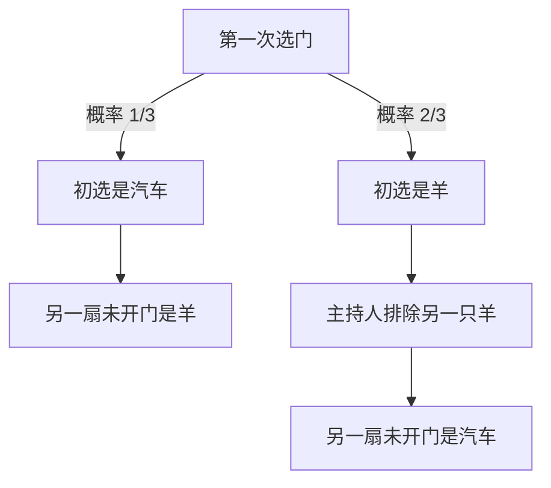

# 04 · 概率论

<SourceNote :start="59" :end="104" section="Chapter 4" />

先读题并独立思考；需要方向时展开提示，完成尝试后再展开讲解。提示、答案和示意图默认收起，每道题可以单独展开。题干按原书译述，补充练习另有标注。

## 4.1 样本空间与事件

### 醉汉登机

<PracticeQuestion :page="62" :end="63">

100 名乘客按顺序登机，第 $n$ 人持有第 $n$ 号座位的票。第一名乘客随机等概率选择一个座位。之后每名乘客若自己的座位空着就坐下，否则从剩余空位中随机等概率选一个。

最后一名乘客能坐到自己座位的概率是多少？

<template #hint>

座位被占后的随机选择会向后传递。哪两个座位决定这条传递何时结束？

</template>
<template #solution>

随机占座的传递会一直持续，直到有人选中 1 号座或 100 号座。若先选中 1 号座，传递终止，最后一人保有座位；若先选中 100 号座，最后一人失去座位。在此之前，这两个空位对每次随机选择完全对称，因此答案为 $1/2$。

</template>
</PracticeQuestion>

知识回顾

原书书页 59–64。事件是样本空间的子集。计算并集时需减去重复部分：

$$
P(A\cup B)=P(A)+P(B)-P(A\cap B).
$$

互斥表示不能同时发生，独立表示一个事件的发生不改变另一个事件的概率。两个概率都为正的互斥事件不可能独立。

指示变量 $I_A$ 在事件发生时为 1，否则为 0，因此 $E[I_A]=P(A)$。把总数写成指示变量之和，是本章反复使用的技巧。

## 4.2 组合分析

### 生日问题

<PracticeQuestion :page="70">

一个班级最少要有多少人，才能使“至少两个人生日相同”的概率大于 $1/2$？假设一年 365 天，忽略闰年，各人的生日独立，且在 365 天中均匀分布。

<template #hint>

先数所有人生日互不相同的情形，按进入班级的顺序依次计算。

</template>
<template #solution>

假定一年 365 天，各人生日独立且等概率。先算“所有生日不同”，再取补集：

$$
P(\text{至少两人同生日})=1-\prod_{k=0}^{n-1}\left(1-\frac{k}{365}\right).
$$

最小使概率超过 $1/2$ 的人数为 23，此时概率约为 $50.73\%$。这是任意两人相同；若要求与某个指定的人同生日，则是另一个问题。

<BirthdayLab />

</template>
</PracticeQuestion>

知识回顾

原书书页 64–72。若考虑顺序，用排列；只关心选出哪些对象，用组合：

$$
P(n,k)=\frac{n!}{(n-k)!},\qquad \binom nk=\frac{n!}{k!(n-k)!}.
$$

分子与分母必须采用相同的计数粒度。例如计算扑克手牌时，两边都应按无序手牌计数，或两边都按有序发牌序列计数。

## 4.3 条件概率

### 双面正硬币

<PracticeQuestion :page="74" :end="75">

1000 枚硬币中，1 枚两面都是正面，其余 999 枚都是公平硬币。随机等概率抽取一枚，连续独立抛掷 10 次，结果全是正面。

在观察到这些结果之后，这枚硬币是双面正硬币的概率是多少？

<template #hint>

分别考虑两类硬币产生这组观测的概率，并同时保留它们被抽中的先验概率。

</template>
<template #solution>

1000 枚硬币中只有 1 枚两面都是正面，其余公平。随机抽一枚，连续抛 10 次均为正面。设 $D$ 为抽中双面正硬币，$H^{10}$ 为观测，则

$$
P(D\mid H^{10})=\frac{1/1000}{1/1000+(999/1000)2^{-10}}
=\frac{1024}{2023}\approx50.62\%.
$$

十次正面虽更支持双面正假设，但公平硬币的先验数量是它的 999 倍。似然与先验必须一起比较。

</template>
</PracticeQuestion>

### 两个孩子：信息怎样获得

<PracticeQuestion :page="73" :end="74">

A. 公司邀请所有“至少有一个儿子”的在职母亲参加晚宴。Jackson 女士有两个孩子，且收到了邀请。她的两个孩子都是男孩的概率是多少？

B. 你知道同事 Parker 女士有两个孩子，看见她带着其中一个孩子散步，这个孩子是男孩。两个孩子都是男孩的概率是多少？

两问均假设每个孩子的性别独立，男、女各半。原书 B 问未明确挑选同行孩子的方式：作答时先说明你对这一机制的假设。

<template #hint>

列出按长幼区分的四种家庭类型。收到邀请与见到一个具体孩子，会怎样筛选这些家庭？

</template>
<template #solution>

两个孩子的题中，假定性别独立且各半。“已知至少一个男孩”排除了 GG，剩下 BB、BG、GB，所以两个都是男孩的概率为 $1/3$。若随机选定其中一个孩子并观察到男孩，另一人的性别仍各半，因此答案为 $1/2$。后一结论依赖观察机制，不能只凭“看到了一个男孩”就省略抽样条件。

</template>
</PracticeQuestion>

### Monty Hall 换门

<PracticeQuestion :page="78">

三扇关闭的门后分别有一辆汽车和两只羊，奖品位置等概率。你先选一扇门。主持人知道汽车在哪，总会从你没选的门中打开一扇有羊的门，并允许你在最后两扇门之间改选。

为了提高赢得汽车的概率，应保留初选还是换门？两种策略的胜率各是多少？

<template #hint>

把情况按“第一次选中汽车”与“第一次没有选中汽车”划分。主持人打开羊门后，各自怎样变化？

</template>
<template #solution>

Monty Hall 题假设主持人知道奖品位置，总是打开未选中的羊门，并总是提供换门机会。换门恰好在初选错误时获胜，故胜率为 $2/3$。

保留初选的胜率为 $1/3$。

</template>
</PracticeQuestion>

### 用偏硬币得到公平结果

<PracticeQuestion :page="75">

你有一枚偏硬币，正面概率固定但未知，且严格介于 0 与 1 之间；各次抛掷相互独立。怎样利用它产生两个概率恰好相同的结果？

<template #hint>

比较两次抛掷中 HT 与 TH 的概率。其他结果一定要立即算作一次输出吗？

</template>
<template #solution>

若每次抛掷独立且正面概率固定为 $p\in(0,1)$，成对抛掷时 HT 与 TH 的概率都为 $p(1-p)$。令它们分别代表两个结果，遇 HH 或 TT 就重试。条件于被接受，两种结果等可能。

</template>
</PracticeQuestion>

知识回顾

原书书页 72–85。观察到事件 $B$ 后，应把样本空间限制到 $B$：

$$
P(A\mid B)=\frac{P(A\cap B)}{P(B)},\qquad P(B)>0.
$$

若 $H_i$ 构成互斥且穷尽的假设划分，则

$$
P(H_i\mid E)=\frac{P(E\mid H_i)P(H_i)}{\sum_j P(E\mid H_j)P(H_j)}.
$$

## 4.4 离散与连续分布

### 等车时间

<PracticeQuestion :page="90" :end="91">

公交车按齐次 Poisson 过程到达，平均每 10 分钟一辆，即 $\lambda=0.1/\text{分钟}$。公交已经运行很久，你在一个与公交过程无关的随机时刻到达车站。

你还要等多久，期望值是多少？上一辆公交平均在多少分钟前离开？

<template #hint>

已经等过多久会影响下一次到达吗？将观察时刻之前和之后分开考虑。

</template>
<template #solution>

对速率为 $\lambda$ 的齐次 Poisson 到达过程，无记忆性使从任意固定时刻开始的期望等待仍为 $1/\lambda$。在平稳观察的模型下，观察时点前后的两个间隔期望各为 $1/\lambda$，跨越该时点的完整间隔期望为 $2/\lambda$。这与随机抽一个到达间隔的均值不同，因为较长的间隔更容易覆盖观察时点。

代入 $\lambda=0.1/\text{分钟}$，向前等待与向后回看的期望都是 10 分钟。

</template>
</PracticeQuestion>

### 两位银行家会面

<PracticeQuestion :page="88">

两位银行家分别在早上 5:00 到 6:00 之间独立、均匀地到达车站。每人到达后恰好停留 5 分钟，然后离开。两人在这一天相遇的概率是多少？

<template #hint>

把两人的到达时间作为平面坐标。怎样用一个不等式表示他们的停留时间有重叠？

</template>
<template #solution>

设两人的到达时间为 $X,Y\in[0,60]$，单位是 5:00 之后的分钟数。二人相遇当且仅当 $|X-Y|\le5$。

<MeetingDiagram />

到达时间均匀且独立，所以概率等于满足条件的区域面积除以正方形总面积。不能会面的区域是两块直角三角形，各自直角边长为 $60-5=55$：

$$
P(\text{会面})=1-\frac{2\cdot\tfrac12\cdot55^2}{60^2}=\frac{23}{144}\approx15.97\%.
$$

**条件对照。** 原书等待时间是 5 分钟。若改成等 15 分钟，才得到 $1-(3/4)^2=7/16$；这是条件改变后的补充例子。

</template>
</PracticeQuestion>

知识回顾

原书书页 86–92。概率质量函数给出离散点的概率；概率密度本身可以大于 1，但区域下的积分才是概率。分布函数统一写作 $F(x)=P(X\le x)$。

| 分布与参数约定 | 场景 | 均值 | 方差 |
| --- | --- | --- | --- |
| Bernoulli$(p)$ | 一次成功指示 | $p$ | $p(1-p)$ |
| Binomial$(n,p)$ | 独立 $n$ 次中的成功数 | $np$ | $np(1-p)$ |
| 几何分布（参数 $p$），取值 $1,2,\ldots$ | 首次成功所需次数 | $1/p$ | $(1-p)/p^2$ |
| Poisson$(\lambda)$ | 固定区间的事件数 | $\lambda$ | $\lambda$ |
| Uniform$(a,b)$ | 区间内均匀位置 | $(a+b)/2$ | $(b-a)^2/12$ |
| 指数分布（速率 $\lambda$） | Poisson 到达间隔 | $1/\lambda$ | $1/\lambda^2$ |
| Normal$(\mu,\sigma^2)$ | 正态波动 | $\mu$ | $\sigma^2$ |

## 4.5 期望、方差与协方差

### 集齐优惠券

<PracticeQuestion :page="97" :end="98">

麦片盒中有 $N$ 种优惠券，每盒恰有一张，各种券出现的概率相同，且不同盒子相互独立。

A. 平均需要购买多少盒，才能集齐每种至少一张？

B. 已购买 $n$ 盒时，拥有的不同种类数的期望是多少？

<template #hint>

A 问可以按“已经集齐多少种”分阶段。B 问可以针对每一种券，问它是否已经出现。

</template>
<template #solution>

每次独立抽取 $n$ 种等概率优惠券之一。已集齐 $k$ 种时，下一张是新种类的概率为 $(n-k)/n$，等待时间均值为 $n/(n-k)$。逐阶段相加：

$$
E[T]=\sum_{k=0}^{n-1}\frac{n}{n-k}=nH_n,\qquad H_n=\sum_{j=1}^n\frac1j.
$$

越接近集齐，等待越长。这个阶段分解比枚举全部抽取序列简单。

上式用 $n$ 表示种类数；按原题符号，A 问为 $NH_N$。B 问对第 $i$ 种券定义“至少出现一次”的指示变量，其期望是 $1-(1-1/N)^n$。由期望线性性质，种类数的期望为 $N[1-(1-1/N)^n]$。

</template>
</PracticeQuestion>

### 最小方差对冲

<PracticeQuestion :page="95" kind="基于本节的补充练习">

给定具有有限二阶矩的随机变量 $X,Y$，且 $\operatorname{Var}(Y)>0$。选择常数 $h$，使对冲后的 $X-hY$ 方差最小。求 $h$。

<template #hint>

先把方差完整展开，包括协方差项。把它看成关于 $h$ 的函数。

</template>
<template #solution>

用 $hY$ 对冲 $X$，最小化 $\operatorname{Var}(X-hY)$。当 $\operatorname{Var}(Y)>0$ 时，对 $h$ 求导得到

$$
h^*=\frac{\operatorname{Cov}(X,Y)}{\operatorname{Var}(Y)}.
$$

这里优化的是给定随机变量的方差，不自动消除非线性风险，也没有考虑交易成本。

</template>
</PracticeQuestion>

知识回顾

原书书页 92–99。期望的线性性质不要求独立；方差相加则要处理协方差：

$$
E\left[\sum_iX_i\right]=\sum_iE[X_i],
$$

$$
\operatorname{Var}(X+Y)=\operatorname{Var}(X)+\operatorname{Var}(Y)+2\operatorname{Cov}(X,Y).
$$

条件化常能避开复杂的联合分布：

$$
E[X]=E[E[X\mid Y]],
$$

$$
\operatorname{Var}(X)=E[\operatorname{Var}(X\mid Y)]+\operatorname{Var}(E[X\mid Y]).
$$

## 4.6 次序统计量

### 最大值与最小值的分布

<PracticeQuestion :page="99" :end="100">

设 $X_1,\ldots,X_n$ 独立同分布于 Uniform$(0,1)$，令 $Y=\min(X_1,\ldots,X_n)$、$Z=\max(X_1,\ldots,X_n)$。分别求 $Y,Z$ 的分布函数、密度函数和期望。

<template #hint>

最大值不超过 $x$，等价于所有原始样本满足什么条件？最小值的哪一个补事件同样容易处理？

</template>
<template #solution>

原书书页 99–104。将独立同分布样本排序为 $X_{(1)}\le\cdots\le X_{(n)}$。对最大值，所有样本都不超过 $x$ 当且仅当最大值不超过 $x$：

$$
P(X_{(n)}\le x)=F(x)^n.
$$

最小值则满足 $P(X_{(1)}>x)=[1-F(x)]^n$。独立性是乘法成立的关键。

对于 $n$ 个独立 Uniform$(0,1)$ 样本，

$$
E[X_{(k)}]=\frac{k}{n+1},\qquad
E[X_{(1)}]=\frac1{n+1},\quad E[X_{(n)}]=\frac n{n+1}.
$$

可把端点 0、1 与排序样本看作 $n+1$ 个随机间隔。各间隔的期望相同且总和为 1，从而得到这个结果。

在 $0<x<1$，$F_Z(x)=x^n$、$f_Z(x)=nx^{n-1}$；$F_Y(x)=1-(1-x)^n$、$f_Y(x)=n(1-x)^{n-1}$。区间外分布函数分别取 0 或 1，密度为零。

</template>
</PracticeQuestion>

### 两个极值的相关性

<PracticeQuestion :page="100" :end="102">

设 $X_1,X_2$ 独立同分布于 Uniform$(0,1)$，$Y=\min(X_1,X_2)$、$Z=\max(X_1,X_2)$。对于 $0<z\le1$，求 $P(Y\ge y\mid Z<z)$，并求 $Y,Z$ 的相关系数。

<template #hint>

给定两点都落在 $[0,z]$ 中，事件 $Y\ge y$ 占据哪个子正方形？计算相关性时，可以利用 $YZ=X_1X_2$。

</template>
<template #solution>

当 $0\le y\le z$ 时，条件样本空间的面积为 $z^2$，满足 $Y\ge y$ 的面积为 $(z-y)^2$，所以

$$
P(Y\ge y\mid Z<z)=\frac{(z-y)^2}{z^2}.
$$

$y<0$ 时概率为 1，$y>z$ 时为 0；$z=0$ 时条件事件概率为零，这个条件概率未定义。

$E[Y]=1/3$、$E[Z]=2/3$、$\operatorname{Var}(Y)=\operatorname{Var}(Z)=1/18$。由于 $YZ=X_1X_2$，$E[YZ]=1/4$，故协方差为 $1/36$，相关系数为 $1/2$。

作为推广，均匀分布下最小值与最大值还满足

$$
\operatorname{Cov}(X_{(1)},X_{(n)})=\frac1{(n+1)^2(n+2)},\qquad
\operatorname{Corr}(X_{(1)},X_{(n)})=\frac1n.
$$

独立的原始样本，其排序后的极值仍可能相关。下一章将把“条件于当前信息”的思想扩展到随时间演化的过程。

</template>
</PracticeQuestion>

本章学习建议

概率题首先是建模题：哪些结果等可能，观察到了什么，以及哪些事件相互独立。明确这些条件后，很多看似复杂的题可以通过补集、条件化、对称性或期望的线性性质解决。

