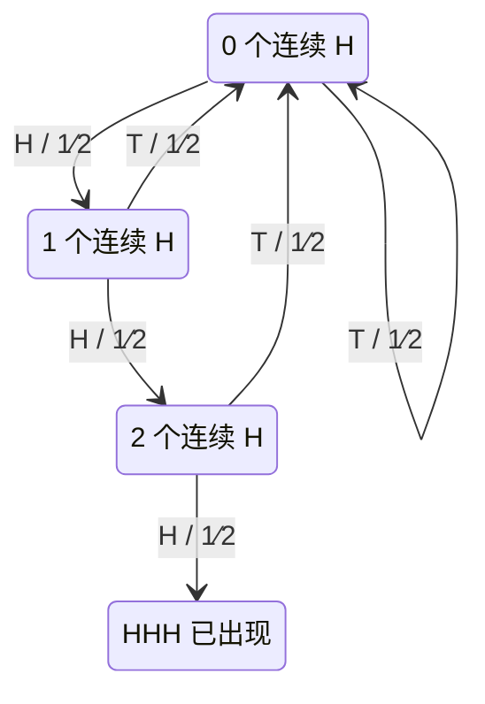
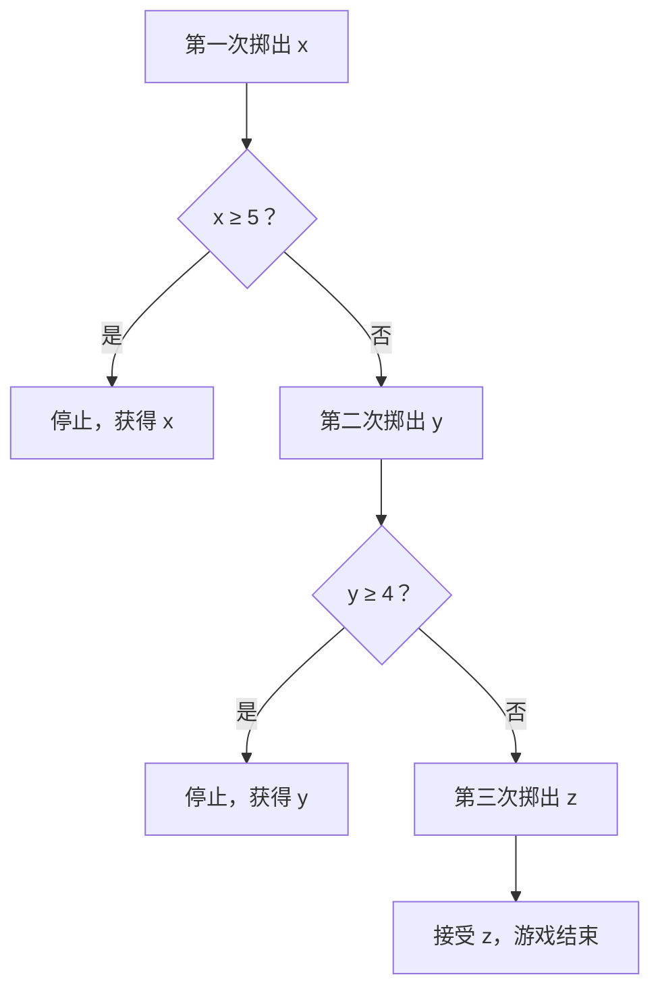

# 05 · 随机过程与随机微积分

<SourceNote :start="105" :end="136" section="Chapter 5" />

先读题并独立思考；需要方向时展开提示，完成尝试后再展开讲解。提示、答案和示意图默认收起，每道题可以单独展开。题干按原书译述，补充练习另有标注。

## 5.1 Markov 链

### 赌徒破产

<PracticeQuestion :page="107" :end="108">

玩家 M 起初有 1 美元，玩家 N 有 2 美元。每局赢家从输家处得到 1 美元，M 每局以 $2/3$ 的概率获胜，各局独立。两人一直玩到其中一人破产。M 最终赢得全部资金的概率是多少？

<template #hint>

总资金不变，只记录 M 当前的资金就够了。条件于下一局的输赢，把成功概率写成递推。

</template>
<template #solution>

资金从 $i$ 开始，每局以 $p$ 概率加 1、以 $q=1-p$ 概率减 1，达到 0 或 $N$ 停止。令 $u_i$ 为先到达 $N$ 的概率，则

$$
u_i=pu_{i+1}+qu_{i-1},\quad u_0=0,\quad u_N=1.
$$

这里左侧 $u_i$ 与右侧是同一个成功概率。解为

$$
u_i=\begin{cases}
\dfrac{1-(q/p)^i}{1-(q/p)^N},&p\ne\frac12,\\[6pt]
\dfrac{i}{N},&p=\frac12.
\end{cases}
$$

边界值给出 $u_0=0,u_N=1$，也可用来检查推导方向是否写反。

原题取 $i=1,N=3,p=2/3$，于是 $u_1=(1-1/2)/(1-1/8)=4/7$。

</template>
</PracticeQuestion>

### 等待硬币序列

<PracticeQuestion :page="109" :end="110">

持续独立抛掷一枚公平硬币，H 表示正面、T 表示反面。

A. 从尚未抛掷开始，首次连续出现 HHH，平均要抛多少次？

B. 首次连续出现 THH，平均又要抛多少次？这里计数包括形成目标序列的最后一次抛掷。

<template #hint>

记录当前序列结尾与目标前缀匹配了多长。一次失败后总是回到同一个状态吗？

</template>
<template #solution>

独立抛公平硬币。把状态定义为“当前尾部连续正面数”，只需要 0、1、2、3 四个状态，3 是终点。

令 $e_k$ 为从状态 $k$ 到终点还需的期望次数：

$$
\begin{aligned}
e_0&=1+\tfrac12e_0+\tfrac12e_1,\\
e_1&=1+\tfrac12e_0+\tfrac12e_2,\\
e_2&=1+\tfrac12e_0,\qquad e_3=0.
\end{aligned}
$$

依次消元可得 $e_0=14$。原书还比较了 THH，其期望为 8。虽然固定三次出现某个序列的概率都为 $1/8$，首次出现的等待时间会受到模式与自身重叠方式的影响。

对于 THH，设 $a,b,c$ 分别表示“尚未匹配”“尾部为 T”“尾部为 TH”时的剩余期望。条件于下一次投掷：

$$
a=1+\tfrac12a+\tfrac12b,\quad b=1+\tfrac12b+\tfrac12c,\quad c=1+\tfrac12b.
$$

解得 $b=6,c=4,a=8$。与 HHH 的差别在于出现新的 T 后，THH 可以保留一个已匹配的前缀。

</template>
</PracticeQuestion>

知识回顾

原书书页 105–115。Markov 性表示给定当前状态后，过去历史不再额外影响下一步的分布。转移矩阵 $P$ 的元素为

$$
P_{ij}=P(X_{t+1}=j\mid X_t=i),\qquad \sum_jP_{ij}=1.
$$

行向量分布满足 $\pi_{t+1}=\pi_tP$。平稳分布满足 $\pi=\pi P$，但是否存在唯一平稳分布、是否从任意初态收敛，需要另行检查链的结构。

## 5.2 鞅与随机游走

### 桥上的醉汉

<PracticeQuestion :page="116" :end="117">

一名醉汉站在一座 100 米长的桥上，初始位置距桥头 17 米。每步独立地以 $1/2$ 概率向前或向后走 1 米，走到 0 米或 100 米时停止。

他先到达 100 米处的概率是多少？到达任一端之前，行走步数的期望是多少？

<template #hint>

分别给“先到终点的概率”和“剩余步数”写递推。两个方程的边界是什么？

</template>
<template #solution>

从位置 $i=17$ 出发，在 0 到 $N=100$ 间对称游走，碰到任一端即停止。由上一节，先到 100 的概率为 $17/100$。期望退出时间 $t_i$ 满足

$$
t_i=1+\tfrac12t_{i-1}+\tfrac12t_{i+1},\qquad t_0=t_N=0.
$$

代入可验证 $t_i=i(N-i)$，所以期望步数为 $17\times83=1411$。这与鞅方法得到的结果一致。

</template>
</PracticeQuestion>

知识回顾

原书书页 115–121。相对于信息集合 $\mathcal F_t$，可积过程 $M_t$ 是鞅，需要满足适应性以及

$$
E[M_{t+1}\mid\mathcal F_t]=M_t.
$$

这是一条条件期望关系。仅有 $E[M_t]$ 不变，不能推出鞅性质；Markov 性与鞅性质也不互相蕴含。

对每步独立取 $\pm1$、概率各半的随机游走 $S_n$，$S_n$ 与 $S_n^2-n$ 都是鞅。第二个例子把累积方差从平方过程中扣除了。

::: tip 停止时刻需要额外条件
停止决策只能使用当前及过去的信息。把确定时刻的期望等式推广到随机停止时刻，还需要可选停止定理的适用条件，例如有界停止时刻，或合适的可积性与一致可积性条件。不能只因为一个过程是鞅，就直接断言任意停止后的期望与起点相同。
:::

Wald 等式在独立同分布增量、有限期望停止次数及相应可积性条件下给出 $E[\sum_{k=1}^T X_k]=E[T]E[X_1]$。它把随机项数的和分解为“次数 × 单次均值”。

## 5.3 动态规划

### 最多掷三次骰子

<PracticeQuestion :page="123">

你可以最多掷三次公平六面骰。第一次或第二次掷出 $x$ 点后，可以立即获得 $x$ 美元并结束游戏，也可以放弃该点数再掷。若掷到第三次，就必须接受第三次的点数作为美元收益。

最优策略是什么？按最优策略，这个游戏的期望收益是多少？

<template #hint>

从最后一次机会开始，先求继续游戏的价值，再倒推到前一次决策。

</template>
<template #solution>

只剩一次时，价值为 $V_1=3.5$。剩两次、尚未掷时：

$$
V_2=\frac16\sum_{x=1}^6\max(x,3.5)=4.25.
$$

剩三次时：

$$
V_3=\frac16\sum_{x=1}^6\max(x,4.25)=\frac{14}{3}.
$$

因此第一次看到 5 或 6 就停止，第二次看到 4、5、6 就停止，第三次接受任何点数。决定是否继续的比较对象是“未来的最优期望收益”，而不是最初那次骰子的均值。

美式期权的提前行权问题具有相同结构：每个状态比较立即行权价值与继续持有价值。

</template>
</PracticeQuestion>

知识回顾

原书书页 121–129。动态规划同时处理状态转移与行动选择。最大化收益时，Bellman 方程可写成

$$
V_t(x)=\max_{a\in A(x)}E\left[r_t(x,a,W)+V_{t+1}(f(x,a,W))\right].
$$

先指定终端收益，再逐步向前倒推。状态必须包含影响后续选择的全部信息；决策只能依赖已观察的信息。

## 5.4 布朗运动与 Itô 引理

### 布朗运动的定义

<PracticeQuestion :page="129">

给出标准布朗运动的定义，并列举它的均值、方差、协方差以及与之相关的常见鞅。

<template #hint>

从初值、路径、不同时间段的增量分布及独立性逐项检查。

</template>
<template #solution>

原书书页 129–136。标准布朗运动 $W_t$ 从零出发，路径连续，具有独立的正态增量：

$$
W_t-W_s\sim N(0,t-s),\quad 0\le s<t.
$$

所以 $E[W_t]=0$、$\operatorname{Var}(W_t)=t$、$\operatorname{Cov}(W_s,W_t)=\min(s,t)$。$W_t$、$W_t^2-t$ 以及 $e^{\lambda W_t-\lambda^2t/2}$ 都是经典鞅。

</template>
</PracticeQuestion>

### 布朗运动的首达时间

<PracticeQuestion :page="131" :end="132">

标准布朗运动 $W_t$ 从零出发。A. 首次到达 $-1$ 或 $1$ 的时间，其期望是多少？B. 对给定 $b>0$，首次到达 $b$ 的时间 $\tau_b$ 的密度函数与期望分别是什么？

<template #hint>

两端退出与只有一个目标边界的停止问题不同。B 问可把到达边界后的路径反射，与终点位置联系起来。

</template>
<template #solution>

从零出发首次离开 $(-a,b)$，其中 $a,b>0$，期望退出时间为 $ab$。只要求首次达到一个正水平 $b$ 时，布朗运动几乎必然会达到，但首次到达时间的期望是无穷。

反射原理给出单边首达时间 $\tau_b$ 的分布：

$$
P(\tau_b\le t)=2\left[1-\Phi\left(\frac b{\sqrt t}\right)\right],\qquad t>0.
$$

两端退出与单边首达的边界不同，不能直接套用同一个期望结果。

A 问取 $a=b=1$，所以期望为 1。对 B 问的分布函数求导，得到

$$
f_{\tau_b}(t)=\frac{b}{\sqrt{2\pi}t^{3/2}}\exp\!\left(-\frac{b^2}{2t}\right),\qquad t>0.
$$

其尾部衰减不足以使 $\int_0^\infty t f_{\tau_b}(t)\,dt$ 收敛，因此期望为无穷。

</template>
</PracticeQuestion>

### Itô 引理与几何布朗运动

<PracticeQuestion :page="135" :end="136" kind="基于本节的推导练习">

设 $W_t$ 是标准布朗运动。求 $d(W_t^2)$，解释它与普通微积分求导的区别。再设 $dS_t=\mu S_tdt+\sigma S_tdW_t$、$S_0>0$，其中 $\mu,\sigma$ 是常数，求 $S_t$ 的显式表达式。

<template #hint>

对平方函数保留二阶项。对于乘性噪声过程，考虑对数变换会怎样改变漂移。

</template>
<template #solution>

若 $dX_t=\mu(t,X_t)dt+\sigma(t,X_t)dW_t$，对时间一阶、空间二阶足够光滑的函数 $f$，有

$$
df=\left(f_t+\mu f_x+\frac12\sigma^2f_{xx}\right)dt+\sigma f_x\,dW_t.
$$

布朗增量的平方在累积意义下产生 $dt$ 量级的贡献，因此二阶项必须保留。例如

$$
d(W_t^2)=2W_t\,dW_t+dt,
$$

减去 $dt$ 就得到 $d(W_t^2-t)=2W_t\,dW_t$。一般情形下，“漂移项为零”首先给出局部鞅，还需可积性条件才能断言是真鞅；这里的多项式布朗运动例子满足相应条件。

对于几何布朗运动 $dS_t=\mu S_tdt+\sigma S_tdW_t$，对 $\ln S_t$ 应用 Itô 引理：

$$
d\ln S_t=\left(\mu-\frac12\sigma^2\right)dt+\sigma dW_t,
$$

$$
S_t=S_0\exp\left[\left(\mu-\frac12\sigma^2\right)t+\sigma W_t\right].
$$

这个表达式连接了下一章的期权公式与第七章的 Monte Carlo 模拟。

</template>
</PracticeQuestion>

本章学习建议

本章把一次随机试验扩展为一系列有依赖的状态。解题时先问：预测下一步需要保留什么信息？如果状态选对，概率、等待时间和最优决策通常都能写成递推方程。

