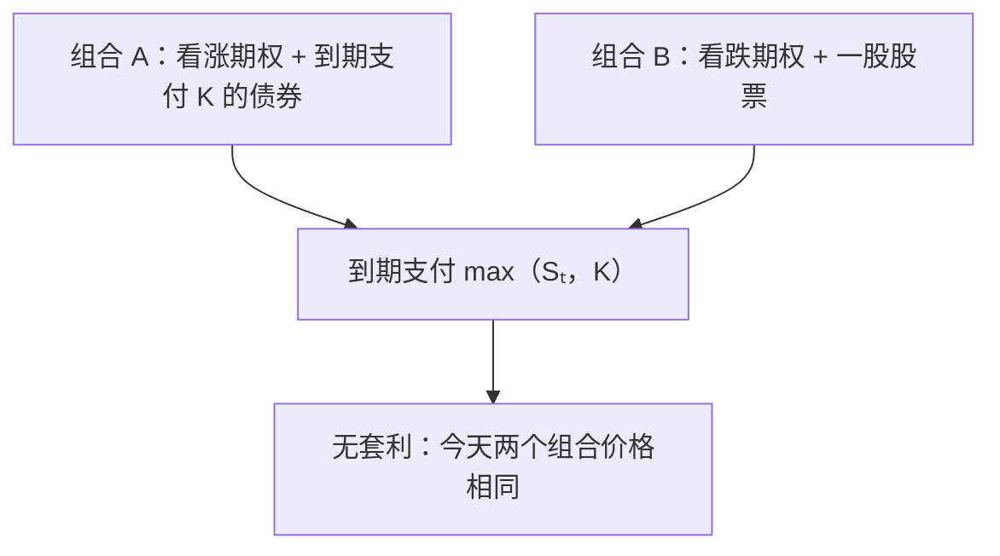

# 06 · 金融与期权

<SourceNote :start="137" :end="170" section="Chapter 6" />

先读题并独立思考；需要方向时展开提示，完成尝试后再展开讲解。提示、答案和示意图默认收起，每道题可以单独展开。题干按原书译述，补充练习另有标注。

## 6.1 期权定价

### Put–call parity

<PracticeQuestion :page="138" :end="139">

一只不支付股息的股票，当前价格为 $S$。同一标的的欧式看涨与看跌期权，执行价均为 $K$，到期时间均为 $\tau$，无风险连续复利利率为 $r$。写出它们的价格 $C,P$ 之间的平价关系，并证明。

<template #hint>

构造两个到期现金流在所有股价下都相同的组合。无套利对当前价格有什么要求？

</template>
<template #solution>

对同一标的、执行价和到期日的欧式期权，若标的不支付股息，两个组合的到期现金流相同：

$$
(S_T-K)^++K=(K-S_T)^++S_T.
$$

无套利因此要求

$$
C-P=S-Ke^{-r\tau},\qquad \tau=T-t.
$$

若存在连续股息率 $q$，则变为 $C-P=Se^{-q\tau}-Ke^{-r\tau}$。离散确定股息可用股息现值处理，不能在未说明约定时把两种形式混用。

</template>
</PracticeQuestion>

### 美式期权提前行权

<PracticeQuestion :page="139" :end="141">

在不支付股息、无风险利率非负的标准模型中，美式看涨期权是否有必要提前行权？美式看跌期权是否也具有相同结论？请从现金流解释。

<template #hint>

提前行权时，哪些现金需要提前支付或提前收回？放弃了哪些仍有价值的选择？

</template>
<template #solution>

在无股息、非负利率的标准模型下，美式看涨期权提前行权会放弃时间价值，并提前支付执行价，因而通常没有提前行权的价值。美式看跌则可能因提前取得执行价现金而提前行权。股息和利率条件改变后，需要重新分析。

</template>
</PracticeQuestion>

### Black–Scholes–Merton 定价

<PracticeQuestion :page="142" :end="148" kind="依据本节整理的推导练习">

假设股票遵循几何布朗运动，可连续交易且没有交易成本，利率与波动率为常数。解释如何用 Delta 对冲推导欧式期权的定价偏微分方程。它为什么不含股票的真实预期收益率 $\mu$？再写出欧式看涨与看跌的定价公式及适用条件。

<template #hint>

对期权价格应用 Itô 引理。选择多少股票头寸才能抵消随机项？自融资的局部无风险组合应怎样增长？

</template>
<template #solution>

原书从几何布朗运动与 Delta 对冲推导。假设可连续调整自融资组合、没有交易成本，波动率与利率为常数。含连续股息率时，期权价格 $V(S,t)$ 满足

$$
V_t+(r-q)SV_S+\frac12\sigma^2S^2V_{SS}-rV=0.
$$

Itô 引理给出期权的随机项 $\sigma SV_SdW_t$；用相应数量的标的头寸抵消后，剩余局部无风险组合按无风险利率增长。真实世界的预期收益率 $\mu$ 因此从定价方程中消失。

**欧式期权公式**

定义标准正态分布函数为 $\Phi$，密度为 $\phi$，并令

$$
d_1=\frac{\ln(S/K)+(r-q+\sigma^2/2)\tau}{\sigma\sqrt\tau},\qquad d_2=d_1-\sigma\sqrt\tau.
$$

则

$$
C=Se^{-q\tau}\Phi(d_1)-Ke^{-r\tau}\Phi(d_2),
$$

$$
P=Ke^{-r\tau}\Phi(-d_2)-Se^{-q\tau}\Phi(-d_1).
$$

$S,K,\sigma,\tau$ 在该表达式中为正。到期或零波动率等边界应使用相应极限。风险中性下看涨到期实值的概率是 $\Phi(d_2)$；它与 Delta 中的 $\Phi(d_1)$ 含义不同。

</template>
</PracticeQuestion>

知识回顾

原书书页 137–148。欧式看涨与看跌期权在到期时分别支付 $(S_T-K)^+$ 与 $(K-S_T)^+$。美式期权允许在到期前选择行权时刻，因此定价还需要考虑最优停止。

## 6.2 Greeks

### 欧式看涨的 Delta

<PracticeQuestion :page="149" :end="150">

在无股息 Black–Scholes 模型下，欧式看涨期权的 Delta 是什么？请从价格公式推导，注意 $d_1,d_2$ 也依赖标的价格 $S$。

<template #hint>

对价格关于 $S$ 求导时保留链式法则。比较两个正态密度项，是否可以抵消？

</template>
<template #solution>

在 $q=0$ 时，价格为 $C=S\Phi(d_1)-Ke^{-r\tau}\Phi(d_2)$。因为 $\partial_S d_1=\partial_S d_2=1/(S\sigma\sqrt\tau)$，

$$
\frac{\partial C}{\partial S}=\Phi(d_1)+\frac{S\phi(d_1)-Ke^{-r\tau}\phi(d_2)}{S\sigma\sqrt\tau}.
$$

由 $d_2=d_1-\sigma\sqrt\tau$ 可验证 $S\phi(d_1)=Ke^{-r\tau}\phi(d_2)$，所以链式项抵消，得到 $\Delta=\Phi(d_1)$。

下面把其他敏感度一并整理，并用模型曲线观察局部斜率与曲率。

原书书页 149–158。Greek 是价格对输入变量的偏导数，表示其他参数固定时的局部变化。先写清变量与单位，再讨论数值。

| 指标 | 定义 | 含义 |
| --- | --- | --- |
| Delta | $\Delta=V_S$ | 标的价格改变一单位的局部价格变化 |
| Gamma | $\Gamma=V_{SS}$ | Delta 随标的价格的变化率 |
| Theta | $\Theta=V_t=-V_\tau$ | 日历时间向前流逝的影响 |
| Vega | $\mathcal V=V_\sigma$ | 波动率改变 1.0 的局部影响 |
| Rho | $\rho=V_r$ | 利率改变 1.0 的局部影响 |

欧式看涨与看跌的 Delta 分别为 $e^{-q\tau}\Phi(d_1)$ 和 $e^{-q\tau}(\Phi(d_1)-1)$。它们的 Gamma 与 Vega 相同：

$$
\Gamma=\frac{e^{-q\tau}\phi(d_1)}{S\sigma\sqrt\tau},\qquad
\mathcal V=Se^{-q\tau}\phi(d_1)\sqrt\tau.
$$

**用参数变化观察价格曲线**

下方固定执行价 $K=100$、年化无风险利率 $r=5\%$、股息率 $q=0$。波动率按年化输入，到期时间按月换算为年。虚线是到期支付，实线是当前模型价格，二者都没有扣除购买期权的成本。

<OptionLab />

对小幅变化，可以使用局部二阶展开：

$$
\Delta V\approx\Delta\,\Delta S+\frac12\Gamma(\Delta S)^2+\Theta\,\Delta t+\mathcal V\,\Delta\sigma.
$$

Delta 中性只抵消一阶标的敞口。原书讨论的多 Gamma 组合仍会受到时间流逝、波动率变化、融资和再平衡成本影响，不能由曲率为正就推断存在套利。Theta 的符号也要结合期权类型、股息和利率判断。

</template>
</PracticeQuestion>

## 6.3 期权组合与奇异期权

### 比较到期支付

<PracticeQuestion :page="158" :end="163" kind="基于本节的补充练习">

写出以下合约的到期支付：买入低执行价看涨并卖出高执行价看涨形成的牛市价差、同执行价多头跨式、支付 1 单位现金的数字看涨，以及允许交换两项资产的交换期权。数字看涨怎样用窄价差近似？两个资产的相关性怎样影响交换期权中的相对波动？

<template #hint>

先逐项列出在到期股价不同区域内的现金流。对于两项资产，检查差值或相对价格中的协方差项。

</template>
<template #solution>

原书书页 158–163。先画出或列出到期支付，再检查贴现后的上下界；支付、价格和利润是三个不同对象。

| 合约或组合 | 到期支付 | 核心性质 |
| --- | --- | --- |
| 牛市看涨价差，$K_1<K_2$ | $(S_T-K_1)^+-(S_T-K_2)^+$ | 支付介于 0 与 $K_2-K_1$ |
| 同执行价多头跨式 | $\lvert S_T-K\rvert$ | 大幅偏离执行价时支付增加；利润需扣成本 |
| 现金数字看涨 | $1_{\{S_T>K\}}$ | 支付不连续，临近到期的对冲更敏感 |
| 交换期权 | $(S_{1,T}-S_{2,T})^+$ | 依赖两个资产的相对变化与相关性 |

数字看涨在标准无股息 Black–Scholes 模型下价格为 $e^{-r\tau}\Phi(d_2)$。窄牛市价差经缩放可近似它，但执行价间距越小，所需期权数量越大；市场执行价和交易成本限制了这种近似。

无股息的交换期权可使用有效波动率

$$
\sigma_{\mathrm{eff}}=\sqrt{\sigma_1^2+\sigma_2^2-2\rho\sigma_1\sigma_2}.
$$

相关性提高会减少相对价格的波动。这里 $\rho$ 表示两个驱动布朗运动的瞬时相关系数。

</template>
</PracticeQuestion>

## 6.4 投资组合、风险与利率

### 两资产最小方差组合

<PracticeQuestion :page="163" :end="164">

用股票 A 和 B 构造一个组合。两者的期望收益率均为 12%，收益率标准差分别为 20% 和 30%，相关系数为 0.5。怎样分配投资权重，才能使组合风险（收益率方差）最小？权重之和为 1。

<template #hint>

用一个权重表示整个组合，展开方差，再对该权重求极值。相同的期望收益会简化哪个约束？

</template>
<template #solution>

若两资产期望收益相同、权重和为 1，令第一资产权重为 $w$，则组合方差为

$$
\sigma_p^2=w^2\sigma_A^2+(1-w)^2\sigma_B^2+2w(1-w)\rho\sigma_A\sigma_B.
$$

无其他约束且分母非零时，求导得

$$
w^*=\frac{\sigma_B^2-\rho\sigma_A\sigma_B}{\sigma_A^2+\sigma_B^2-2\rho\sigma_A\sigma_B}.
$$

原书示例 $\sigma_A=20\%$、$\sigma_B=30\%$、$\rho=0.5$ 给出 $w^*=6/7$。这是指定输入与目标下的数学例子；若禁止卖空或增加收益约束，需要把这些限制纳入优化。

</template>
</PracticeQuestion>

### VaR 与尾部损失

<PracticeQuestion :page="165" kind="原书概念自测">

给定损失变量 $L$ 和置信水平 $\alpha$，怎样定义 $\operatorname{VaR}_\alpha$？它是否告诉你超过该阈值后的平均损失？怎样补充评估尾部风险？

<template #hint>

分位数描述的是位置。它是否包含超过该位置之后的损失大小？

</template>
<template #solution>

对损失变量 $L$，$\operatorname{VaR}_\alpha$ 可定义为其 $\alpha$ 分位数。它描述给定期限下的损失阈值，并不等于超过阈值后的平均损失，也不描述最坏损失。非线性衍生品的尾部与相关性变化可能使简单近似失效；原书因此将其与压力测试、情景分析一起讨论。

</template>
</PracticeQuestion>

### 久期与凸性

<PracticeQuestion :page="166" :end="167" kind="原书概念自测">

债券价格随收益率变化，记为 $P(y)$。如何定义修正久期和凸性，并利用二者近似小幅收益率变化 $\Delta y$ 对债券价格的影响？这种近似需要保留哪些约定和限制？

<template #hint>

对 $P(y+\Delta y)$ 在当前收益率附近做二阶展开，再除以当前价格。

</template>
<template #solution>

把债券价格看作收益率 $y$ 的函数 $P(y)$，定义修正久期 $D=-P'(y)/P(y)$ 与凸性 $C=P''(y)/P(y)$，则

$$
\frac{\Delta P}{P}\approx-D\Delta y+\frac12C(\Delta y)^2.
$$

数值依赖收益率的复利约定。期限结构并非总是平行移动，单一久期只能概括特定的局部变化方向。

</template>
</PracticeQuestion>

### 远期、期货与短利率

<PracticeQuestion :page="168" :end="170" kind="原书概念自测">

远期与期货的结算方式有何区别，随机利率为什么可能使两者价格不同？比较 Vasicek 与 CIR 短利率模型的动态与利率边界。

<template #hint>

现金流在何时发生，会怎样影响再投资？两种模型的噪声系数对当前利率的依赖是否相同？

</template>
<template #solution>

远期的价值在结算时实现，期货逐日盯市。随机利率下，盯市现金流的再投资与标的相关性会影响二者的定价关系；确定性利率下通常可得到相同的远期与期货价格。

| 原书讨论的短利率模型 | 动态 | 关键区别 |
| --- | --- | --- |
| Vasicek | $dr=\kappa(\theta-r)dt+\sigma dW$ | 均值回归，正态动态允许负利率 |
| CIR | $dr=\kappa(\theta-r)dt+\sigma\sqrt r\,dW$ | 波动随利率水平变化，标准参数下非负 |

CIR 在常见充分条件 $2\kappa\theta\ge\sigma^2$ 且从正值出发时零边界不可达。讨论这些模型时，应把漂移含义、参数约束和采用的概率测度一起说明。

</template>
</PracticeQuestion>

本章学习建议

本章从到期现金流与无套利出发，再讨论定价方程、风险敏感度和数值建模。以下公式是原书模型的学习整理，交互数值由模型计算，未接入市场数据。

