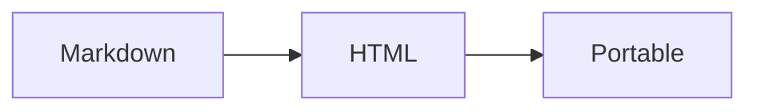

<script setup>
import { ref } from "vue"

const count = ref(0)
</script>

# Portable Export Fixture

This page exercises local assets, formulas, charts, Vue interaction, and Outline.

## Local asset


## Formula

$$
E = mc^2
$$

## Mermaid



## ECharts

```echarts
{
  "xAxis": { "type": "category", "data": ["A", "B", "C"] },
  "yAxis": { "type": "value" },
  "series": [{ "type": "bar", "data": [2, 5, 3] }]
}
```

## Vue interaction

<button id="portable-counter" type="button" @click="count += 1">
  Count: {{ count }}
</button>

### Nested outline entry

The exported page keeps its nested outline.
